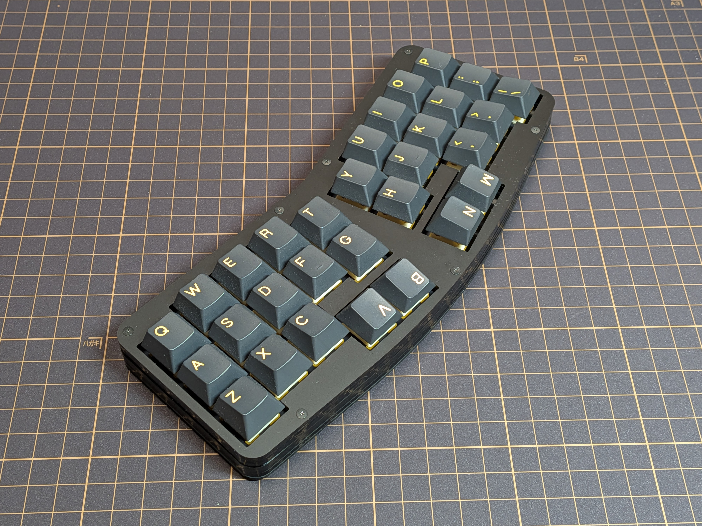

## 《3行×10列親指ずらし配列カラムスタッガード・キーボード》「Whale30」ガイド

3行×10列の30キーでありながら、親指を活用して36キー程度のキーボードと遜色なく使用できることを目指したキーボードです。

### 製作動機
前作「Dolphin30」は、(準)オルソリニア型で3×10=30キーのコンセプトを実現したキーボードでした。

ただ、オルソリニアである以上、脇を締めたような姿勢が、やや窮屈に感じられることもあるのも事実です。

Dolphin30のミニマルさを維持しつつ、左右のキーの間を開いてやや角度をつけ、両腕がハの字に開いて打てるようになり、打鍵時の姿勢が楽になりました。

### 特長
- 親指を存分に活用して入力できるように、3行目の中央4キーを0.5uだけ下にずらしてあります。
- 親指で4つのキーの文字入力およびレイヤーの切り替えをしながら、省スペースでスムーズな打鍵をすることができます。
- Vialに対応し、キーマップを自由に変更することが出来ます。
- 最小限のキー数で、複数レイヤーや、同時押しでの入力(VialのCombo機能)を活用し、通常のキーボードと遜色なく使用することが出来ます。
- マイコンとUSB端子を分離することで、コンパクトな設置面積と最小限の高さ(ゴム足からスイッチプレート上部まで15.5mm、アッパーパネル上面まで19mm)を両立しています。

[このキーボードの配列について](layout.md)

- このキーボードを設計した動機について。(Dolphin30の記事を再掲)

[キーマップについて](keymap.md)

- このキーボードの実際の使い勝手・使い方について。(Dolphin30の記事を再掲)

[ビルドガイド](build.md)

- このキーボードの作成手順です。

[ファームウェア](firmware/readme.md)

- このキーボードのファームウェアが置いてあります。
